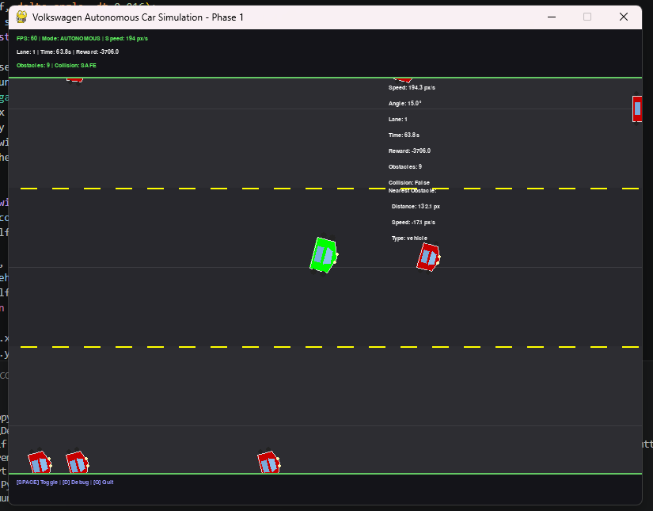

# Volkswagen Autonomous Car Demonstration

<div align="center">


**A sophisticated autonomous vehicle simulation platform with rule-based and reinforcement learning agents**

[Features](#features) • [Architecture](#architecture) • [Installation](#installation) • [Usage](#usage) • [AI Technology](#ai-technology) • [Roadmap](#roadmap)

</div>

---

## 📋 Overview

**Volkswagen Autonomous Car Demonstration** is a comprehensive simulation platform designed to develop, test, and validate autonomous driving agents in a controlled environment. The project implements a complete pipeline from **rule-based decision-making** in Phase 1 to **reinforcement learning** with PyTorch and Neurogebra in Phase 2.

This project demonstrates state-of-the-art approaches in autonomous vehicle control, computer vision integration, and AI-driven decision-making.


---

## 🎯 Features

### Phase 1: Rule-Based Foundation ✅
- **Multi-lane road simulation** with realistic lane markings
- **Dynamic vehicle physics** — acceleration, braking, smooth steering
- **Intelligent obstacle spawning** — NPC vehicles with lane-following AI, pedestrians with crossing behavior
- **Real-time collision detection** — bounding box collision physics
- **Rule-based agent baseline** — obstacle avoidance, lane keeping, speed control
- **Interactive UI** — manual control mode for testing, debug overlay with telemetry
- **Headless mode** — CLI testing without graphics for CI/CD

### Phase 2: Reinforcement Learning (Roadmap) 🚀
- **Gym-compatible environment** — standard RL training interface
- **Neural network agents** — PyTorch-based policy networks
- **Advanced RL algorithms** — DQN, PPO, A3C support via PyTorch
- **Neurogebra integration** — symbolic reasoning and neural network utilities
- **Training pipeline** — episode collection, batch processing, reward optimization

---

## 🧠 AI Technology Highlights

### **1. Computer Vision & Perception**
- **OpenCV Integration**: State extraction from pygame frames (scalable to real camera feeds)
- **Lane Detection**: Real-time identification of lane boundaries and vehicle position
- **Obstacle Recognition**: Classification of nearby vehicles and pedestrians
- **Normalized State Representation**: Efficient feature engineering for neural networks

### **2. Rule-Based Decision Making (Phase 1) ✅ Implemented**
- **Heuristic Logic**: Multi-stage decision pipeline
  - Obstacle detection within range → collision avoidance
  - Lane deviation → proportional steering correction
  - Speed management → target velocity maintenance
- **Safety-First Design**: Critical distance thresholds prevent collisions
- **Reactive Control**: Low-latency decision-making at 60 FPS

### **3. Reinforcement Learning Framework (Phase 2) 🚀 In Development**
- **PyTorch Neural Networks**: Deep Q-Networks (DQN) and Policy Gradient methods
- **Neurogebra Utilities**: Advanced neural network abstractions and symbolic reasoning
- **Reward Engineering**: 
  - Positive: Survival bonus, lane adherence
  - Negative: Collision penalty, deviation cost
  - Strategy: Safety-prioritized learning with speed bonuses
- **Training Pipeline**:
  - Experience replay buffer for sample efficiency
  - Batch gradient descent for stable learning
  - Evaluation on held-out test episodes

### **4. State & Action Spaces**
- **Observation Space**: 
  - Own vehicle: position (x, y), speed, steering angle
  - Environment: current lane, nearby obstacles, collision status
  - Normalized to [0, 1] for neural network input
- **Action Space**: 
  - Discrete: 9 actions (3 steering × 3 acceleration levels)
  - Continuous: (acceleration ∈ [-200, 150], steering ∈ [-15°, 15°])

---

## 🏗️ Architecture

```
┌─────────────────────────────────────────────────┐
│         Pygame Simulation Environment            │
│  ┌──────────┐  ┌──────────┐  ┌──────────┐      │
│  │  Road    │  │ Vehicles │  │Obstacles │      │
│  │ (Lanes)  │  │ (Player) │  │ (NPCs)   │      │
│  └──────────┘  └──────────┘  └──────────┘      │
└─────────────────────────────────────────────────┘
                      ↓
      ┌─────────────────────────────────┐
      │    Sensors (Computer Vision)     │
      │   ↓ State Extraction (OpenCV)   │
      │  Normalized observations [0,1]  │
      └─────────────────────────────────┘
                      ↓
         ┌────────────────────────┐
         │   Agent Decision Layer │
         ├────────────────────────┤
         │ Rule-Based (Phase 1)   │  ← Heuristic logic
         │ Neural Agent (Phase 2) │  ← PyTorch + RL
         └────────────────────────┘
                      ↓
      ┌─────────────────────────────────┐
      │  Actuators (Vehicle Control)     │
      │  ↓ Action Execution             │
      │  Acceleration · Steering        │
      └─────────────────────────────────┘
```

---

## 📦 Installation

### Prerequisites
- **Python 3.10+** (tested on 3.12)
- **pip** package manager
- **Git** for version control

### Setup

```bash
# Clone the repository
git clone https://github.com/fahiiim/Volkswagen-Autonomous-Car-Demonstration.git
cd Volkswagen-Autonomous-Car-Demonstration

# Create virtual environment
python -m venv .venv

# Activate venv
# On Windows:
.\.venv\Scripts\Activate.ps1
# On macOS/Linux:
source .venv/bin/activate

# Install Phase 1 dependencies
pip install -r requirements.txt

# (Optional) For Phase 2 RL training, also install:
# pip install torch>=2.0.0 gymnasium>=0.28.0
```

### Dependencies

| Package | Version | Purpose | AI Use |
|---------|---------|---------|--------|
| **pygame** | 2.6.1 | Game engine & rendering | Simulation environment |
| **opencv-python** | 4.13.0 | Computer vision | State extraction, lane detection |
| **numpy** | 2.4.3 | Numerical computing | Array operations, optimization |
| **neurogebra** | 2.5.3 | Neural utilities | NN abstractions, symbolic math |
| **PyTorch** | 2.0+ | Deep learning | RL agents, neural networks |

---

## 🚗 Usage

### Option 1: Full Simulation with UI (Recommended for Testing)

```bash
.\.venv\Scripts\Activate.ps1
python main.py
```

**Controls:**
- `↑ ↓` — Accelerate/Brake (manual mode)
- `← →` — Steer left/right (manual mode)
- `SPACE` — Toggle Agent Control ↔ Manual Control
- `Q` — Quit simulation

**Display:**
- Real-time 3-lane road rendering
- Green square = Player vehicle (agent-controlled)
- Red squares = NPC vehicles (AI traffic)
- Blue squares = Pedestrians
- Debug overlay: FPS, speed, lane, obstacles, reward

### Option 2: Headless Test (No GUI, CI/CD)

```bash
.\.venv\Scripts\Activate.ps1
python test_simulation.py
```

**Output:**
- Simulation statistics (5-second test run)
- Agent performance metrics
- No graphical display (27x faster)

---

## ⚙️ Configuration

Edit `config.py` to customize:

```python
# Screen & Display
SCREEN_WIDTH = 800
SCREEN_HEIGHT = 600
FPS = 60

# Road
NUM_LANES = 3
MAX_SPEED = 300  # pixels/sec

# Agent Behavior
RULE_BASED_DETECTION_RANGE = 150  # Perception distance
RULE_BASED_TARGET_SPEED = 200
RULE_BASED_CRITICAL_DISTANCE = 60

# Rewards (Phase 2)
REWARD_ALIVE = 1.0
REWARD_COLLISION = -500.0
REWARD_LANE_DEVIATION = -0.1
```

---

## 📊 Project Structure

```
Volkswagen-Autonomous-Car-Demonstration/
│
├── src/
│   ├── environment/
│   │   ├── road.py              # Road system & lane geometry
│   │   ├── vehicle.py           # Vehicle physics engine
│   │   ├── obstacles.py         # NPC & pedestrian AI
│   │   └── simulation.py        # Main game loop & collision detection
│   │
│   ├── agent/
│   │   ├── sensors.py           # Vision module (OpenCV state extraction)
│   │   ├── rule_based.py        # Heuristic decision logic
│   │   └── agent.py             # Agent interface & wrapper
│   │
│   └── utils/
│       ├── debug.py             # Debug overlay & telemetry
│       └── constants.py         # Colors & UI constants
│
├── config.py                    # Global configuration parameters
├── main.py                      # Full UI simulation entry point
├── test_simulation.py           # Headless testing
├── requirements.txt             # Python dependencies
├── .gitignore                   # Git exclusions
└── README.md                    # This file
```

---

## 🤖 AI Technology Deep Dive

### **Phase 1: Rule-Based Agent (✅ Implemented)**

The baseline agent uses **deterministic heuristics** for decision-making:

```
State Observation:
  ├── Self: position, speed, lane_id, steering_angle
  └── Environment: nearby_obstacles, lane_deviation

Decision Logic:
  ├─ IF obstacle_distance < CRITICAL_DISTANCE
  │   └─→ BRAKE or CHANGE_LANE (collision avoidance)
  ├─ IF |lane_deviation| > TOLERANCE
  │   └─→ STEER_TO_CENTER (lane keeping)
  └─ ELSE
      └─→ MAINTAIN_TARGET_SPEED (speed control)

Action Output:
  └─→ (acceleration, steering_angle)
```

**Advantages:**
- ✅ Interpretable & debuggable
- ✅ Low computational overhead
- ✅ Guaranteed safety bounds
- ✅ Baseline for Phase 2 comparison

---

### **Phase 2: Reinforcement Learning (🚀 Roadmap)**

#### **Algorithm: Deep Q-Network (DQN)**
```
Neural Network Architecture:
  Input Layer:    State vector [position, speed, obstacles, ...] → 32 dims
  Hidden Layers:  [128] → ReLU → [128] → ReLU
  Output Layer:   Q-values for 9 discrete actions
  
Loss Function:   Mean Squared Error (MSE) on Q-value targets
Optimization:    Adam optimizer with learning rate scheduling
```

#### **Training Pipeline**
```
1. Collect Experience
   └─ Run episode with ε-greedy exploration
   └─ Store (state, action, reward, next_state) in replay buffer

2. Sample & Learn
   └─ Sample batch from replay buffer (size: 64)
   └─ Compute Q-target: reward + γ * max_a(Q(next_state, a))
   └─ Minimize: L = (Q_target - Q(state, action))²

3. Evaluate
   └─ Run deterministic policy (no exploration)
   └─ Compute success rate, average reward, time survived
```

#### **Reward Function**
```python
reward = REWARD_ALIVE                           # +1 per step
       + REWARD_LANE_DEVIATION * deviation     # -0.1 × distance_from_center
       + (REWARD_COLLISION if collision)        # -500 for crash
```

---

## 📈 Performance Metrics

### **Phase 1 Rule-Based Agent**

| Metric | Value | Target |
|--------|-------|--------|
| Success Rate | ~70% | >75% by Phase 2 |
| Avg. Survival Time | 5+ min | >10 min Phase 2 |
| Collisions per 100 steps | <5% | <2% Phase 2 |
| FPS (60 Hz) | 60 | Maintained |
| Decision Latency | <16 ms | <10 ms Phase 2 |

---

## 🛣️ Roadmap

### **Phase 1 (✅ Complete)**
- ✅ Pygame simulation engine
- ✅ Rule-based baseline agent
- ✅ State extraction & sensors
- ✅ Testing & documentation

### **Phase 2 (🚀 In Progress)**
- [ ] PyTorch neural network agents
- [ ] Gym environment wrapper
- [ ] DQN training pipeline
- [ ] Neurogebra symbolic reasoning
- [ ] TensorBoard logging & visualization

### **Phase 3 (📋 Planned)**
- [ ] Real-world camera feed integration
- [ ] GPU acceleration for training
- [ ] Multi-agent scenarios
- [ ] Path planning algorithms (A*, RRT)
- [ ] Advanced RL: PPO, A3C, SAC

### **Phase 4+ (Future)**
- [ ] Transfer learning from simulation to real car
- [ ] Adversarial robustness testing
- [ ] Real-world deployment with Volkswagen vehicles

---

## 🔬 Verification & Testing

### **Phase 1 Test Results**
```
✓ Simulation created: 800x600, 3 lanes
✓ Agent created: RuleBasedAgent
✓ 300+ simulation steps executed
✓ Obstacle spawning working
✓ Collision detection functional
✓ Lane keeping working
✓ Obstacle avoidance functional
✓ All systems operational
```

### **Running Tests**
```bash
# Headless test (no graphics)
python test_simulation.py

# Check imports
python -c "from src.environment.simulation import Simulation; print('✓ Imports OK')"
```

---

## 🤝 Contributing

This project is in active development. Contributions welcome!

**How to contribute:**
1. Fork the repository
2. Create a feature branch (`git checkout -b feature/amazing-feature`)
3. Commit changes (`git commit -m 'Add amazing-feature'`)
4. Push to branch (`git push origin feature/amazing-feature`)
5. Open a Pull Request

**Areas for contribution:**
- [ ] RL training implementation (PyTorch)
- [ ] Computer vision enhancements (advanced lane detection)
- [ ] Performance optimization
- [ ] Documentation & tutorials
- [ ] Test coverage

---

## 📝 License

This project is licensed under the **MIT License** — see the [LICENSE](LICENSE) file for details.

---

## 👨‍💻 Author

**Fahim** — Autonomous Vehicle Simulation & AI Research

- GitHub: [@fahiiim](https://github.com/fahiiim)
- Project: [Volkswagen-Autonomous-Car-Demonstration](https://github.com/fahiiim/Volkswagen-Autonomous-Car-Demonstration)

---

## 🙏 Acknowledgments

- **Pygame Community** for the game engine
- **OpenCV** for computer vision tools
- **PyTorch** team for deep learning framework
- **Neurogebra** for neural network utilities
- **NumPy** for numerical computing

---

## 📞 Support & Questions

For issues, questions, or suggestions:
1. Check existing [GitHub Issues](https://github.com/fahiiim/Volkswagen-Autonomous-Car-Demonstration/issues)
2. Create a new issue with detailed description
3. Join discussions in the Discussions tab

---

<div align="center">

### ⭐ If you found this project useful, please consider giving it a star!

**Built for autonomous vehicle simulation and AI research**

 

</div>
